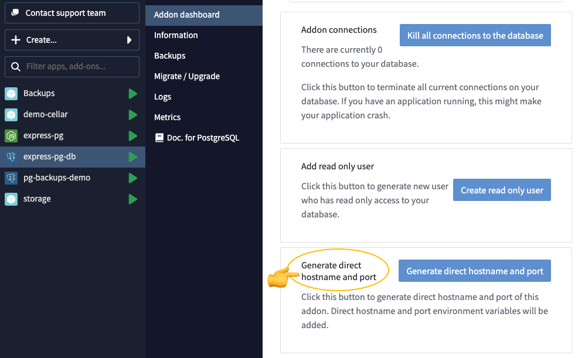

# NodeJS-PostgreSQL-Demo

This is an example Node.js application that works with PostgreSQL on Clever Cloud.

The application is a very simple list where you can add or delete values.

To install it, simply fork this repository and create an application from your GitHub repo.
Then create a PostgreSQL add-on and link it to your application, either via the <a href="https://www.clever-cloud.com/doc/clever-tools/getting_started/" target="_blank">Clever Tools CLI</a> or via the <a href="https://console.clever-cloud.com/" target="_blank">Clever Cloud console</a>.

## Direct port and host

Since this application can't run without connecting to a DB, ensure connections are quick by enabling direct port and host on your PostgreSQL add-on before deploying this app:

That's it, the application will use the `POSTGRESQL_ADDON_DIRECT_URI` environnement variable to connect to the PostgreSQL DB.
